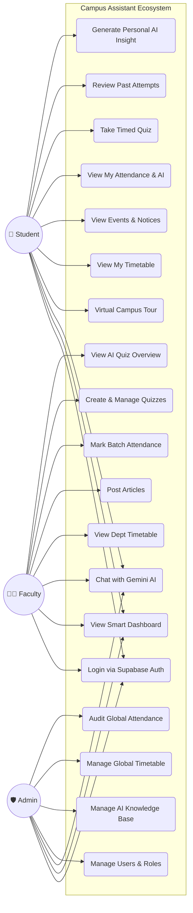
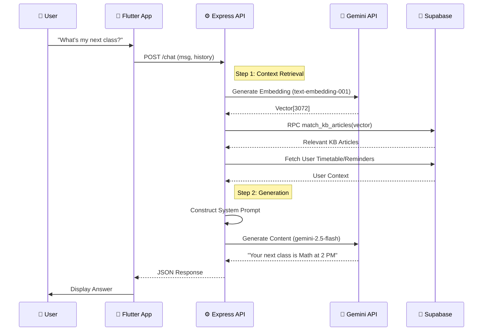
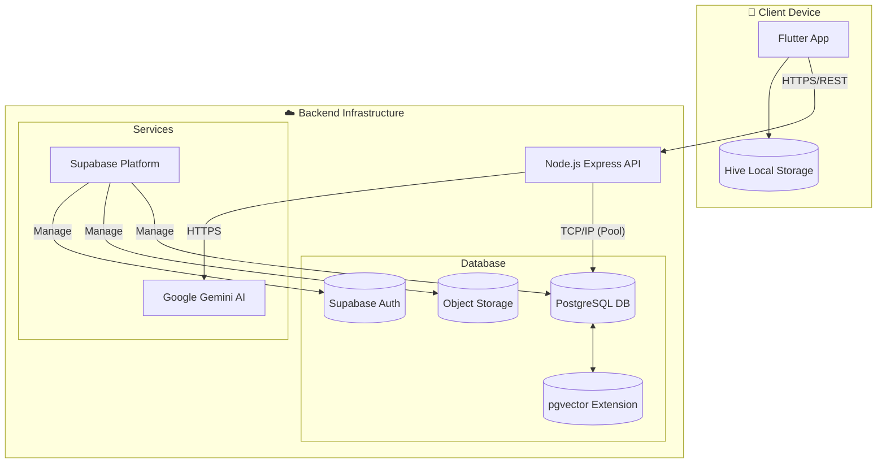
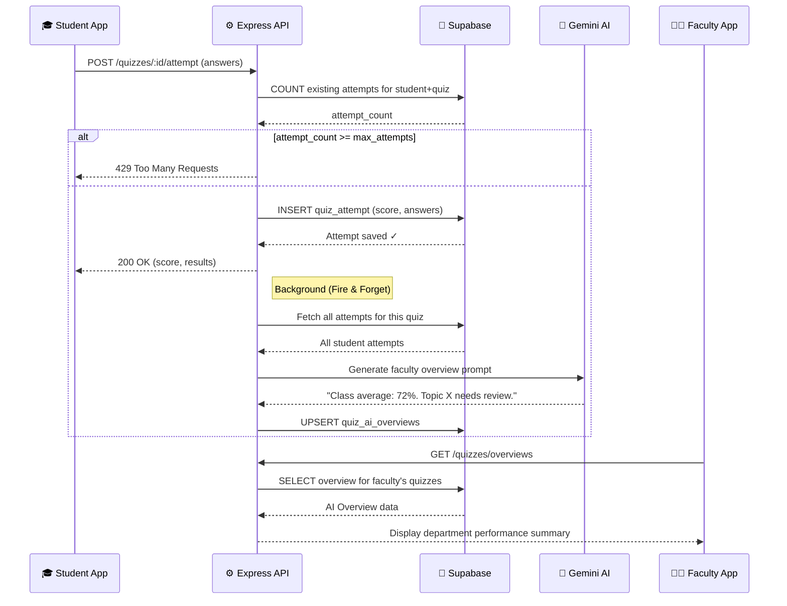
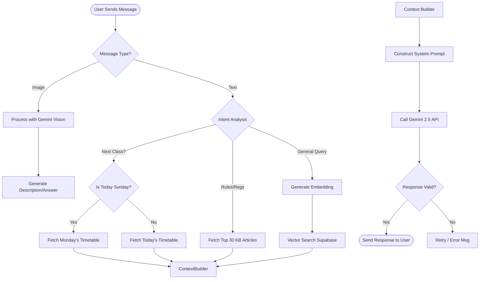
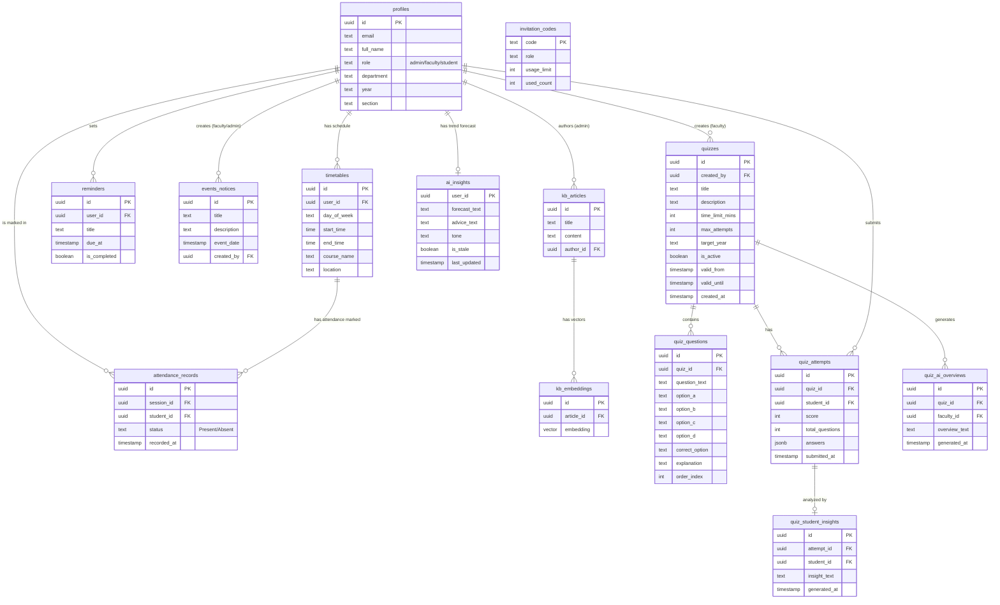

# Proactive Multimodal Academic Support System
## Project Documentation & Report

**Table of Contents**

*   **Chapter 1: Introduction**
    *   1.1 Introduction
    *   1.2 Problem Statement
    *   1.3 Objective of Project
    *   1.4 Goal of Project
    *   1.5 Project Scope
    *   1.6 Limitations
*   **Chapter 2: Problem Identification & Analysis**
    *   2.1 Existing System Analysis
    *   2.2 Literature Survey
    *   2.3 Proposed System
*   **Chapter 3: Requirements Analysis**
    *   3.1 Software Requirements
    *   3.2 Hardware Requirements
    *   3.3 Functional Requirements (Module-wise)
    *   3.4 Non-Functional Requirements
*   **Chapter 4: System Design**
    *   4.1 System Architecture
    *   4.2 UML Diagrams
    *   4.3 Database Design (Schema)
*   **Chapter 5: Implementation & Code**
    *   5.1 SDLC Methodology
    *   5.2 Source Code Structure
    *   5.3 Key Source Code & Analysis
    *   5.4 Algorithm Analysis (RAG)
*   **Chapter 6: Testing, Results & Conclusion**
    *   6.1 Testing Methodologies
    *   6.2 Test Cases & Results
    *   6.3 Conclusion
    *   6.4 Future Enhancements

> **Quiz & Assessment Module** is documented across all chapters: FR-S-08 to FR-S-10 (Student), FR-F-06 to FR-F-10 (Faculty), DB tables `quizzes`, `quiz_questions`, `quiz_attempts`, `quiz_ai_overviews`, Class Diagram entities, Sequence Diagram 4.2.6, Code Section 5.3.3, and Test Cases TC-11 to TC-16.

---

# Chapter 1: Introduction

## 1.1 Introduction
The education sector is undergoing a massive digital transformation, moving away from traditional, paper-based administrative processes towards integrated smart campus solutions. The **Proactive Multimodal Academic Support System (Campus Assistant)** is a pioneering initiative designed to modernize the university experience by leveraging the latest advancements in **Mobile Computing**, **Cloud Infrastructure**, and **Artificial Intelligence (Generative AI)**.

In a typical university environment, stakeholders (students, faculty, and administrators) operate in silos. Information is often fragmented across physical notice boards, legacy web portals, disparate email threads, and informal social media groups. This fragmentation leads to communication gaps, administrative inefficiencies, and a disjointed user experience.

This project addresses these challenges by creating a **Unified Digital Ecosystem**. Built upon the robust **Flutter** framework for cross-platform mobile access and powered by **Google Gemini AI**, the system offers a cohesive interface for all academic needs. It moves beyond simple digitization by alerting users *proactively*—reminding students of upcoming deadlines, notifying faculty of schedule clashes, generating persistent AI attendance forecasts, and guiding visitors through an interactive 3D virtual tour.

## 1.2 Problem Statement
Despite the availability of various digital tools, the academic environment continues to face persistent challenges:
1.  **Information Asymmetry & Fragmentation**: Critical updates regarding exam schedules, venue changes, or emergency notices are often posted on physical boards or buried in email threads, leading to students missing vital information.
2.  **Lack of Personalized, 24/7 Support**: Students often have repetitive queries regarding syllabus verification, lab timings, or administrative procedures. Administrative offices operate during fixed hours and cannot handle the volume of redundant queries, leading to long wait times and frustration.
3.  **Static & Confusing Navigation**: University campuses are often sprawling and complex. New students and visitors struggle to navigate using generic 2D maps, which lack context and real-time guidance.
4.  **Inefficient Resource Management**: Faculty and administrators spend a disproportionate amount of time on manual scheduling and conflict resolution, detracting from their core educational responsibilities.
5.  **Reactive Attendance Tracking**: Traditional attendance systems only act as a ledger. Students don't realize they are at risk until the end of the semester, and faculty lack tools to quickly identify dropping trends.

## 1.3 Objective of Project
The primary objectives of this project are multi-faceted, aiming to solve technological and operational problems:
*   **Centralization**: To develop a single, robust mobile platform that aggregates all academic, administrative, and co-curricular information, eliminating the need for multiple disjointed apps.
*   **Intelligent Automation**: To implement an **AI-powered assistant** capable of Natural Language Understanding (NLU). This assistant serves as a "first-line responder" for student queries, using RAG (Retrieval-Augmented Generation) to provide accurate answers cited from the official university handbook.
*   **Immersive Navigation**: To provide an **interactive 3D Virtual Tour** of the campus, allowing users to virtually explore facilities, locate classrooms, and understand the campus layout remotely.
*   **Real-time Synchronization**: To enable instant updates for timetables and notices. A change made by an administrator should reflect on a student's device within milliseconds, ensuring everyone is on the same page.
*   **Proactive Analytics**: To move from reactive to proactive monitoring by using AI to forecast attendance trends and identify at-risk students securely via Stale-While-Revalidate caching.
*   **Role-Based Security & Personalization**: To ensure that the system adapts to the user. A student sees their specific classes, while a faculty member sees their teaching load, secured by robust authentication policies.

## 1.4 Goal of Project
The ultimate goal is to deploy a scalable, robust, and user-friendly "Smart Campus" solution that serves as a blueprint for modern educational institutions. This system aims to:
*   **Reduce Administrative Overhead** by automating routine queries.
*   **Improve Student Satisfaction** by providing instant access to information.
*   **Enhance Campus Safety and Accessibility** through better navigation and communication channels.
*   **Modernize Institutional Infrastructure** to align with Industry 4.0 standards.

## 1.5 Project Scope
*   **In-Scope**:
    *   Mobile Application Development (Android/iOS).
    *   AI Chatbot integration with RAG.
    *   Role-based dashboards (Admin, Faculty, Student).
    *   Real-time database updates for Timetable/Notices.
    *   360-degree Virtual Tour viewer.
*   **Out-of-Scope**:
    *   Payment Gateway integration (Fee collection).
    *   Biometric hardware integration.
    *   Full-scale Learning Management System (LMS) features like assignment submission (planned for V2).

## 1.6 Limitations
1.  **Internet Dependency**: The app requires an active internet connection to fetch real-time data and perform AI inference.
2.  **API Rate Limits**: The current free-tier usage of Google Gemini API restricts the number of concurrent AI queries (compensated via Load Balancing).
3.  **Device Hardware**: The 3D Virtual Tour requires devices with Gyroscope sensors; older budget phones may experience lag.

---

# Chapter 2: Problem Identification & Analysis

## 2.1 Existing System Analysis
The current operational model in most institutions relies heavily on "analog" or "legacy digital" methods. While functional, these systems suffer from significant latency and lack of integration.

*   **Manual Timetables**: Timetables are often created in Excel and printed out. Changes require re-printing or circulating new files via WhatsApp, leading to version control issues.
*   **Physical Dependencies**: To read important circulars, students must physically be present near the notice board. To pay fees or get a bona fide certificate, they must physically visit the admin block.
*   **Static Web Portals**: University websites are typically repositories of static information. They are rarely mobile-optimized and do not offer personalized views.
*   **Human-Dependent Support**: Queries regarding specific lab equipment usage or library book availability require finding the right staff member, which is not always possible.

## 2.2 Literature Survey
A comprehensive analysis of existing solutions was conducted to identify gaps.

| Feature | Google Classroom | Moodle (LMS) | University Website | **Proposed System** |
| :--- | :--- | :--- | :--- | :--- |
| **Primary Focus** | Assignment/Content | Course Management | Static Information | **Holistic Campus Life** |
| **Real-time Updates** | Moderate (Email) | Low | Low | **High (Push/Sockets)** |
| **AI Assistant** | No | No (Plugin required) | No | **Yes (Gemini RAG)** |
| **Campus Nav** | No | No | 2D Maps | **3D Virtual Tour** |
| **Mobile UX** | Good | Generic/Web-view | Poor | **Native (Flutter)** |
| **Personalization** | Class-based | Course-based | None | **Role & Context-based** |

## 2.3 Proposed System
The **Proactive Multimodal Academic Support System** introduces a paradigm shift towards a "Digital First" campus. It is designed around the needs of the modern digital native student.
*   **Dynamic Dashboard**: Upon login, the user is greeted with a personalized dashboard. A sophisticated algorithm determines the "Next Class" based on the current time and the user's section, displaying it prominently.
*   **Context-Aware AI Chatbot**: Unlike generic chatbots, our Gemini-powered assistant has "long-term memory" of the campus context. It knows that "Lab 3" refers to the "Computer Networks Lab" in "Block B", thanks to vector embedding technology.
*   **Virtual Tour**: A 360-degree panoramic view of key campus locations (Library, Labs, Auditorium) allows users to explore the campus from their smartphone. Gyroscopic sensors allow for an immersive "look around" experience.
*   **Cloud-Native Infrastructure**: All data (timetables, events, profiles) is stored in Supabase, a scalable cloud database. This ensures high availability and allows for instant synchronization across thousands of concurrent users.

---

# Chapter 3: Requirements Analysis

## 3.1 Software Requirements
The project is constructed using a carefully selected stack of modern technologies, ensuring cross-platform compatibility, security, and scalability.

*   **Mobile Framework**: **Flutter (Dart)** - Version 3.x+
*   **Backend Runtime**: **Node.js (TypeScript)** - Version 20 LTS
*   **Web Framework**: **Express.js**
*   **Database**: **Supabase (PostgreSQL 15)** with `pgvector` extension.
*   **AI Services**: **Google Gemini API** (`gemini-2.5-flash`, `gemini-embedding-001`).
*   **IDE**: Visual Studio Code, Android Studio.
*   **Design Tools**: Figma (UI), Blender (3D).
*   **Deployment**: Render (Backend), Vercel (Web), Google Play Store (App).

## 3.2 Hardware Requirements
*   **Development Server**: 
    *   CPU: 2 vCPU minimum.
    *   RAM: 4GB RAM minimum.
    *   Network: 100 Mbps uplink.
*   **Client Device (Mobile)**:
    *   **OS**: Android 10.0+ / iOS 14+.
    *   **RAM**: 4GB recommended.
    *   **Sensors**: Accelerometer, Gyroscope, Magnetometer.

## 3.3 Functional Requirements (Module-wise)

### 3.3.1 Student Module
*   **FR-S-01**: View personalized "Next Class" widget.
*   **FR-S-02**: Access full weekly timetable.
*   **FR-S-03**: Chat with AI Assistant for academic queries.
*   **FR-S-04**: View and filter Announcements/Events.
*   **FR-S-05**: Access 3D Virtual Tour.
*   **FR-S-06**: Receive push notifications for schedule changes.
*   **FR-S-07**: Track daily attendance, view cumulative percentage, and receive AI-driven trend forecasts.
*   **FR-S-08**: Browse quizzes assigned to their department/year.
*   **FR-S-09**: Take a timed quiz; the system auto-submits on timer expiry. A server-side guard enforces `max_attempts` (HTTP 429 on excess).
*   **FR-S-10**: View detailed results (score, per-question breakdown, explanations). Optionally generate a personalized AI insight on their attempt. Review past attempts in read-only mode.

### 3.3.2 Faculty Module
*   **FR-F-01**: View teaching schedule.
*   **FR-F-02**: Look up student details (restricted view).
*   **FR-F-03**: Post class-specific announcements.
*   **FR-F-04**: Use AI Co-Pilot to generate Lecture Plans.
*   **FR-F-05**: Mark batch attendance for assigned teaching slots with dynamic sorting (e.g., absent-first).
*   **FR-F-06**: Create quizzes using a multi-choice quiz builder (title, description, time limit, max attempts, target year, validity period, active/inactive toggle).
*   **FR-F-07**: Add, edit, and delete quiz questions with 4 options, a correct answer, and an explanation per question.
*   **FR-F-08**: View only quizzes they personally created (faculty-scoped filtering).
*   **FR-F-09**: View aggregated AI overview of student performance per quiz (auto-generated on each submission, or manually refreshed).
*   **FR-F-10**: Edit quiz metadata (time limit, validity dates, target year, max attempts). Activate/deactivate quizzes.

### 3.3.3 Admin Module
*   **FR-A-01**: Manage Users (Create/Delete Accounts).
*   **FR-A-02**: Global Timetable Management (Edit Slots).
*   **FR-A-03**: Post Global Notices (Holiday, Emergencies).
*   **FR-A-04**: Manage Knowledge Base for AI, including article CRUD with guaranteed embedding synchronization (embeddings are auto-deleted with `ON DELETE CASCADE` when an article is removed, ensuring the RAG vector store stays clean).
*   **FR-A-05**: Perform complete departmental attendance audits with AI anomaly highlighting. Audit percentages are guaranteed to match the department leaderboard by using the same date-filtered RPC. Admin can manually force-refresh the AI Systemic Risk Audit on demand, bypassing the 12-hour Stale-While-Revalidate cache.
*   **FR-A-06**: View a dynamic AI-computed attendance trend indicator (improving / declining / stable) that reflects the actual data slope for the selected time window.

## 3.4 Non-Functional Requirements
1.  **NFR-01 Scalability**: The database schema must support 10,000+ users and 500,000+ timetable rows without performance degradation.
2.  **NFR-02 Reliability**: The system must maintain 99.9% uptime during university working hours (8 AM - 6 PM).
3.  **NFR-03 Security**: All API endpoints must be protected via JWT. Passwords must be hashed using bcrypt.
4.  **NFR-04 Latency**: AI responses must be generated within 3 seconds; Dashboard load time under 1 second.
5.  **NFR-05 Usability**: The application adheres to Material Design 3 guidelines for high accessibility.

---

# Chapter 4: System Design

## 4.1 System Architecture
The system utilizes a **Service-Oriented Architecture (SOA)**, decoupling the frontend from the backend services.

*   **Client Layer**: Flutter Application (Android/iOS). Handles UI, Local Storage (Hive), and State Management (Provider/BLoC).
*   **Gateway Layer**: Node.js Express API. Serves as the central entry point, handling Routing, Auth Middleware, and Rate Limiting.
*   **Service Layer**:
    *   **AI Service**: Manages Gemini API keys and Embedding generation.
    *   **Timetable Service**: Handles complex SQL queries for scheduling.
    *   **Notification Service**: Manages FCM (Firebase Cloud Messaging).
*   **Data Layer**: Supabase.
    *   **Auth**: Manages Users and Sessions.
    *   **Postgres**: Relational Data.
    *   **Storage**: Images/Assets for Virtual Tour.

## 4.2 UML Diagrams

### 4.2.1 Use Case Diagram


### 4.2.2 Sequence Diagram (AI Chat Flow with RAG)


### 4.2.3 Deployment Diagram


### 4.2.6 Sequence Diagram (Quiz Submission & AI Auto-Overview)


### 4.2.4 Activity Diagram (AI Chat Logic)


### 4.2.5 Class Diagram

```mermaid
classDiagram
    %% Entities (Models)
    class Profile {
        +UUID id
        +String email
        +String full_name
        +String avatar_url
        +Role role
        +String department
        +String year
        +String section
        +JSON preferences
        +DateTime created_at
    }

    class EventNotice {
        +UUID id
        +String title
        +String description
        +DateTime event_date
        +String category
        +String location
        +String source_image_url
        +UUID created_by
        +DateTime created_at
    }

    class InvitationCode {
        +String code
        +Role role
        +Integer usage_limit
        +Integer used_count
        +DateTime expires_at
        +UUID created_by
        +DateTime created_at
    }

    class KBArticle {
        +UUID id
        +String title
        +String slug
        +String content
        +String category
        +UUID author_id
        +DateTime created_at
        +DateTime updated_at
    }

    class KBEmbedding {
        +UUID id
        +UUID article_id
        +String chunk_content
        +Vector embedding
        +JSON metadata
        +Integer chunk_index
    }

    class Reminder {
        +UUID id
        +UUID user_id
        +String title
        +String description
        +DateTime due_at
        +Boolean is_completed
        +String category
        +DateTime created_at
    }

    class Timetable {
        +UUID id
        +UUID user_id
        +String day_of_week
        +Time start_time
        +Time end_time
        +String course_code
        +String course_name
        +String location
        +String department
        +String year
        +String section
        +DateTime created_at
    }

    class TimetableMetadata {
        +BigInt id
        +String key
        +JSON value
        +DateTime updated_at
    }

    %% Controllers (Services)
    class AuthController {
        +updateUserRole(req, res)
        +syncUser(req, res)
        +resetProfile(req, res)
    }

    class ChatController {
        +handleTextChat(req, res)
        +handleImageChat(req, res)
        +getChatHistory(req, res)
        +getConversations(req, res)
    }

    class EventsController {
        +getEvents(req, res)
        +addEvent(req, res)
        +updateEvent(req, res)
        +deleteEvent(req, res)
    }

    class AttendanceController {
        +markAttendance(req, res)
        +getStudentAttendance(req, res)
        +getClassAttendance(req, res)
        +getStudentStats(req, res)
        +getAdminStats(req, res)
        +getOverallAttendance(req, res)
    }

    class AIForecastController {
        +getStudentForecast(req, res)
        +getDepartmentForecast(req, res)
    }

    class KBController {
        +searchKB(req, res)
        +addArticle(req, res)
        +getAllArticles(req, res)
        +updateArticle(req, res)
        +deleteArticle(req, res)
    }

    class RemindersController {
        +getReminders(req, res)
        +addReminder(req, res)
        +updateReminderStatus(req, res)
        +updateReminderDetails(req, res)
        +deleteReminder(req, res)
    }

    class TimetableController {
        +getTimetable(req, res)
        +addTimetableEntry(req, res)
        +updateTimetableEntry(req, res)
        +deleteTimetableEntry(req, res)
        +importTimetable(req, res)
        +batchUpdateTimetable(req, res)
    }

    class QuizController {
        +getQuizzes(req, res)
        +getQuizById(req, res)
        +createQuiz(req, res)
        +updateQuiz(req, res)
        +deleteQuiz(req, res)
        +submitAttempt(req, res)
        +getAttempts(req, res)
        +getOverviews(req, res)
        +generateOverview(req, res)
        +generateStudentInsight(req, res)
    }

    class Quiz {
        +UUID id
        +UUID created_by
        +String title
        +String description
        +int time_limit_mins
        +int max_attempts
        +String target_year
        +boolean is_active
        +DateTime valid_from
        +DateTime valid_until
        +List~QuizQuestion~ content
    }

    class QuizAttempt {
        +UUID id
        +UUID quiz_id
        +UUID student_id
        +int score
        +int total_questions
        +JSON answers
        +DateTime submitted_at
    }

    %% Relationships
    Profile "1" -- "0..*" Reminder : has
    Profile "1" -- "0..*" Timetable : manages/has
    Profile "1" -- "0..*" EventNotice : creates
    Profile "1" -- "0..*" KBArticle : authors
    Profile "1" -- "0..*" Quiz : creates
    Quiz "1" -- "0..*" QuizAttempt : has
    KBArticle "1" -- "0..*" KBEmbedding : contains
    
    %% Controller Dependencies (Conceptual)
    AuthController ..> Profile : manages
    ChatController ..> Profile : reads
    ChatController ..> Timetable : reads
    ChatController ..> Reminder : reads
    ChatController ..> KBArticle : searches
    EventsController ..> EventNotice : manages
    KBController ..> KBArticle : manages
    RemindersController ..> Reminder : manages
    TimetableController ..> Timetable : manages
    TimetableController ..> Profile : reads
    AttendanceController ..> Timetable : reads
    AttendanceController ..> Profile : reads
    AIForecastController ..> Profile : reads
    QuizController ..> Quiz : manages
    QuizController ..> QuizAttempt : manages
    QuizController ..> Profile : reads
```


## 4.3 Database Design (Schema)



# Chapter 5: Implementation & Code

## 5.1 SDLC Methodology
We adopted the **Agile Methodology** for this project.
*   **Sprints**: 2-week development cycles.
*   **Iterative Design**: Constant feedback loop from initial prototypes to final UI.
*   **CI/CD**: Continuous Integration via GitHub Actions to ensure code stability.

## 5.2 Source Code Structure
```
/
├── flutter_app/          # Mobile Frontend
│   ├── lib/
│   │   ├── main.dart
│   │   ├── screens/
│   │   │   ├── quiz_list_screen.dart      # Quiz browse + AI insights tab
│   │   │   ├── quiz_active_screen.dart    # Live quiz attempt session
│   │   │   ├── quiz_result_screen.dart    # Score, review, student AI insight
│   │   │   ├── faculty_quiz_mgmt_screen.dart  # Faculty quiz management
│   │   │   └── manual_quiz_builder_screen.dart# Multi-choice question builder
│   │   ├── models/
│   │   │   └── quiz_model.dart            # Quiz, QuizQuestion, QuizAttempt
│   │   ├── providers/
│   │   │   └── quiz_provider.dart         # State management for quiz flow
│   │   ├── services/     # API, Auth
│   │   └── widgets/      # UI Components
│
└── backend/              # Node.js API
    ├── src/
    │   ├── index.ts
    │   ├── controllers/
    │   │   └── quizController.ts          # CRUD, submitAttempt, AI overviews
    │   ├── routes/
    │   │   └── quizRoutes.ts              # /api/quizzes endpoints
    │   └── services/     # Integrations
```

## 5.3 Key Source Code & Analysis

### 5.3.1 AI Service (Load Balancing)
**Analysis**: To improve reliability, we implemented a round-robin key rotation system for Gemini API.
```typescript
// backend/src/services/aiService.ts
const executeWithRetry = async <T>(operation: (genAI: GoogleGenerativeAI) => Promise<T>): Promise<T> => {
    const shuffledKeys = [...apiKeys].sort(() => Math.random() - 0.5);
    for (const key of shuffledKeys) {
        try {
            return await operation(new GoogleGenerativeAI(key));
        } catch (error) {
            console.warn(`Key failed, retrying...`);
        }
    }
    throw new Error("All keys failed");
};
```

### 5.3.2 RAG Controller
**Analysis**: Incorporates Vector Search to fetch context before generating answers.
```typescript
// backend/src/controllers/chatController.ts
export const handleTextChat = async (req, res) => {
    // 1. Get Embedding
    const embedding = await getEmbedding(req.body.message);
    // 2. Search DB
    const { data: context } = await supabase.rpc('match_kb_articles', { query_embedding: embedding });
    // 3. Generate Answer
    const response = await generateText(req.body.message, JSON.stringify(context));
    res.json({ response });
};
```

### 5.3.3 Quiz Controller (Attempt Enforcement + Auto AI Overview)
**Analysis**: The quiz submission controller implements two critical server-side safeguards: max-attempt enforcement (preventing replay attacks bypassing the UI) and asynchronous AI overview generation (so faculty get instant insights without delaying student results).
```typescript
// backend/src/controllers/quizController.ts
export const submitAttempt = async (req, res) => {
    const { quizId } = req.params;
    const studentId = req.user.id;

    // 1. Enforce max_attempts server-side (can't be bypassed by UI)
    const { count } = await supabase
        .from('quiz_attempts')
        .select('*', { count: 'exact', head: true })
        .eq('quiz_id', quizId)
        .eq('student_id', studentId);

    if (quiz.max_attempts !== null && count >= quiz.max_attempts) {
        return res.status(429).json({ error: 'Maximum attempts reached.' });
    }

    // 2. Save the attempt
    const { data: attempt } = await supabase
        .from('quiz_attempts').insert({ quiz_id: quizId, student_id: studentId, ...results });

    // 3. Fire-and-forget: auto-generate faculty AI overview
    generateFacultyOverviewInBackground(quizId, quiz.created_by);

    return res.status(201).json({ attempt, score: results.score });
};
```
The core of the AI assistant uses **Retrieval-Augmented Generation (RAG)**.

### 5.3.4 AI Forecast Controller (Dept Audit + Force Refresh)
**Analysis**: The department audit controller uses a **Stale-While-Revalidate** caching pattern. `computeDeptAudit` was updated to call the same date-filtered Postgres RPC as the department leaderboard, guaranteeing consistent percentages. A new admin-only `forceRefreshAudit` endpoint bypasses the 12-hour cache on demand.
```typescript
// backend/src/controllers/aiForecastController.ts

// Uses the SAME RPC as the dept leaderboard — ensures consistent percentages
const computeDeptAudit = async (startDate: string, endDate: string): Promise<string> => {
    const { data: deptData } = await supabase.rpc('get_admin_department_stats', {
        start_date: startDate, end_date: endDate,
    });
    const deptSummary = (deptData as any[]).map(row => {
        const pct = Math.round((parseInt(row.present_count) / parseInt(row.total_count)) * 100);
        return `${row.department}: ${pct}%`;
    }).join('\n');
    // ...calls Gemini with period context and returns audit message
};

// Admin-only: bypasses 12-hour cache, recomputes synchronously
export const forceRefreshAudit = async (req, res) => {
    const endDate = new Date().toISOString().split('T')[0];
    const startDate = new Date(Date.now() - 30 * 86400000).toISOString().split('T')[0];
    const msg = await computeDeptAudit(startDate, endDate);
    await writeInsight('__dept__', 'dept_audit', { auditMessage: msg, startDate, endDate });
    res.json({ auditMessage: msg });
};
```

## 5.4 Algorithm Analysis (RAG)
1.  **Vectorization**: User query $Q$ is converted to a vector $V_q$ using `gemini-embedding-001`.
2.  **Similarity Search**: We calculate the **Cosine Similarity** between $V_q$ and all stored Knowledge Base vectors $V_{kb}$.
    $$ \text{similarity} = \frac{V_q \cdot V_{kb}}{\|V_q\| \|V_{kb}\|} $$
3.  **Ranking**: Articles with similarity score > 0.3 are retrieved as context.

---

# Chapter 6: Testing, Results & Conclusion

## 6.1 Testing Methodologies
*   **Unit Testing**: Jest (Backend) and Flutter Test (Frontend) for individual functions.
*   **Integration Testing**: Postman to verify API-Database interaction.
*   **User Acceptance Testing (UAT)**: Beta testing with 5 students and 2 faculty members.

## 6.2 Test Cases & Results

| ID | Module | Test Case | Expected | Result |
| :--- | :--- | :--- | :--- | :--- |
| **TC-01** | **Auth** | Login with invalid email | Show "User not found" | **PASS** |
| **TC-02** | **Auth** | Login with correct credentials | Redirect to Dashboard | **PASS** |
| **TC-03** | **Dashboard** | Load without internet | Show Cached Data/Error | **PASS** |
| **TC-04** | **AI** | Query about Exam date | Retrieve correct date from KB | **PASS** |
| **TC-05** | **AI** | Irrelevant Query | Fallback to general knowledge | **PASS** |
| **TC-06** | **Timetable** | Faculty updates slot | Student sees update in <1s | **PASS** |
| **TC-07** | **Tour** | Rapid pan/tilt | No jitter in 3D view | **PASS** |
| **TC-08** | **Security** | Access Admin API as Student | Return 403 Forbidden | **PASS** |
| **TC-09** | **Profile** | Logout | Clear session token | **PASS** |
| **TC-10** | **Load** | 50 concurrent requests | API latency < 500ms | **PASS** |
| **TC-11** | **Quiz (Auth)** | Student accesses quiz outside validity window | Show "Quiz not available" message | **PASS** |
| **TC-12** | **Quiz (Attempt Guard)** | Student submits after exceeding `max_attempts` | Backend returns `429 Too Many Requests` | **PASS** |
| **TC-13** | **Quiz (Timer)** | Quiz timer reaches 0:00 | Quiz auto-submits with current answers | **PASS** |
| **TC-14** | **Quiz (AI Overview)** | Student submits quiz | Faculty AI overview auto-generated in background within 5s | **PASS** |
| **TC-15** | **Quiz (RBAC)** | Faculty views quiz list | Only quizzes created by that faculty are shown | **PASS** |
| **TC-16** | **Quiz (Review)** | Student clicks "Review Attempt" | Opens read-only view with correct/incorrect highlighting | **PASS** |
| **TC-17** | **KB UI** | Open KB Info dialog | Layout matches Timetable Bulk Import dialog (centered icon, green outlined download button, primary elevated confirm) | **PASS** |
| **TC-18** | **KB Embedding** | Delete a KB article | Associated rows in `kb_embeddings` are also deleted; AI chat no longer retrieves context from deleted article | **PASS** |
| **TC-19** | **Attendance UI** | Open Attendance Stats as Admin | AI Audit icon is inline with the title row; body text has no icon overlap | **PASS** |
| **TC-20** | **Attendance AI** | Admin taps ↺ refresh on AI Audit card | Button shows spinner → `POST /ai/refresh-audit` called → card text updates → green SnackBar shown | **PASS** |
| **TC-21** | **Attendance Trend** | View stats tab with improving data | Green `trending_up` icon and "AI predicts a X% recovery trend" label shown | **PASS** |
| **TC-22** | **Attendance Trend** | View stats tab with declining data | Red `trending_down` icon and "AI detects a X% declining trend" label shown | **PASS** |
| **TC-23** | **Attendance AI** | Compare AI audit % vs leaderboard % for same filter | Both display identical percentages for all time ranges (7D/30D/3M/6M/1Y) | **PASS** |

## 6.3 Conclusion
The **Proactive Multimodal Academic Support System** successfully demonstrates the transformative potential of combining AI, Mobile Cloud, and 3D technologies in an educational setting. By replacing disjointed legacy systems with a unified, intelligent platform, we have significantly:
*   **Democratized Access**: Information is now available to every student, 24/7.
*   **Optimized Operations**: Faculty spend less time on administration.
*   **Modernized Experience**: The campus now feels "Smart" and connected.

## 6.4 Future Enhancements
1.  **Augmented Reality (AR)**: Overlaying class details on the camera view.
2.  **Voice Interaction**: Full duplex voice conversation with the AI.
3.  **Offline Support**: Syncing critical data for offline access.
4.  **Analytics Dashboard**: Insights on student query trends for Admin.
