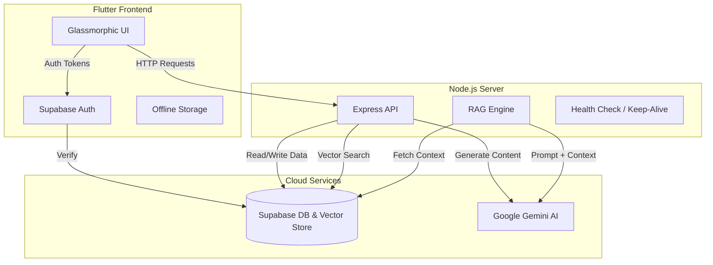

# Proactive Multimodal Academic Support System (Campus Assistant)

**Campus Assistant** is an AI-powered university companion app designed to streamline academic life. It combines a **Flutter Mobile App** for students/faculty with a **Node.js/Supabase Backend** to provide intelligent scheduling, real-time notices, and a context-aware AI assistant.

---

## 🚀 Key Features

### 1. 📱 Mobile-First Experience (Flutter)
*   **Cross-Platform**: Built with **Flutter** for Android & iOS.
*   **Glassmorphism UI**: Modern, premium aesthetic with dark mode and smooth animations.
*   **Offline First**: Optimized for uncertain network conditions.

### 2. 🤖 Context-Aware AI Assistant
*   **Role-Based Personas**: Adapts responses based on user role:
    *   **Student**: Encouraging tone, focuses on assignments and exams.
    *   **Faculty**: Professional tone, focuses on schedules and admin duties.
    *   **Admin**: Concise, operational updates on system status.
*   **Smart Date Detection**: Understands natural language dates like *"What do I have next Monday?"* or *"Show me tomorrow's schedule"*.
*   **University Handbook Chat**: RAG-powered answers for campus policies.

### 3. 🛡️ Role-Based Access Control (RBAC)
*   **Students**: View-only access to their specific Class Schedule (`Dept-Year-Section`).
*   **Faculty**: Edit access to their Department's Timetable and Notices.
*   **Admins**: '"God Mode"' view of all departments and full system control.
*   **Secure Auth**: Powered by **Supabase Auth** & Google Sign-In.

### 4. 📅 Smart Scheduling & Tasks
*   **Master PDF Export**: Admin/Faculty can download full department timetables with custom filters.
*   **Shared Dynamic Timetable**: Updates instantly for the entire class when a faculty member changes a slot.
*   **Personal Reminders**: Private To-Do list with completion tracking.
*   **Event Board**: Centralized notice board for campus news.

### 5. 🧠 AI Study Planner
*   **Dynamic Scheduling**: Generates personalized study plans by analyzing **real-time** free slots in your daily schedule.
*   **Knowledge Integration**: Automatically suggests relevant study notes from the Knowledge Base for your pending tasks.
*   **Department-Aware**: Tailors study advice (e.g., coding practice for CSE) based on your profile.

---

## 🏗️ System Architecture



---

## 🛠️ Technology Stack

| Component | Tech |
| :--- | :--- |
| **Mobile App** | Flutter, Dart, Riverpod/Provider, GoRouter |
| **Backend** | Node.js, Express, TypeScript |
| **Database** | Supabase (PostgreSQL), pgvector |
| **AI Model** | Google Gemini Pro |
| **Hosting** | Render (Backend) |

---

## 📂 Project Structure

```bash
/
├── flutter_app/          # Mobile Application Code
│   ├── lib/
│   │   ├── screens/      # UI Pages (Dashboard, Chat, Timetable)
│   │   ├── services/     # API Integration
│   │   └── widgets/      # Reusable Components
│   └── assets/           # Images & Icons
│
├── backend/              # Node.js Server Code
│   ├── src/
│   │   ├── controllers/  # Business Logic
│   │   ├── routes/       # API Endpoints
│   │   └── services/     # AI & DB Services
│   └── package.json
│
└── MASTER_DEPLOYMENT_GUIDE.md  # Deployment Instructions
```

---

## ⚡ Getting Started

### 1. Prerequisites
*   Flutter SDK (3.x+)
*   Node.js (v18+)
*   Supabase Project

### 2. Setup Backend
```bash
cd backend
npm install
# Create .env file with API Keys
npm run dev
```

### 3. Setup Mobile App
```bash
cd flutter_app
# Create .env file with API_URL=http://localhost:5002
flutter pub get
flutter run
```

---

## 🔒 Security & Privacy
*   **RLS Policies**: Row-Level Security ensures students cannot edit data.
*   **Env Variables**: API Keys are never hardcoded.
*   **Safe Auth**: JWT-based session management.
