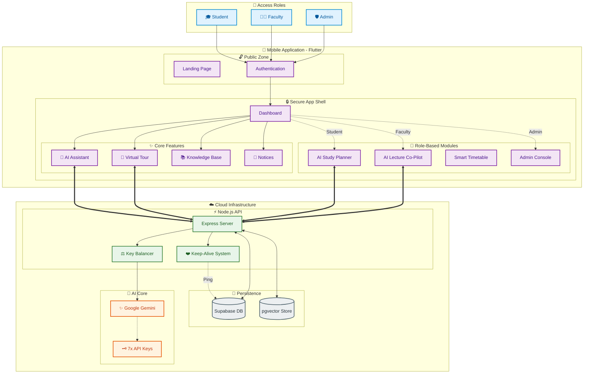

# Proactive Multimodal Academic Support System (Campus Assistant)

**Campus Assistant** is an advanced, AI-powered university companion app designed to revolutionize the student experience. It seamlesssly integrates a **Flutter Mobile App**, a **Node.js/Supabase Backend**, and **Google Gemini AI** to provide a unified platform for navigation, scheduling, and academic assistance.

---

## 🚀 Key Features

### 1. 🏛️ Immersive Landing Experience [UPDATED]
*   **Interactive 3D Campus Model**: A vertically centered, rotating 3D low-poly university building optimized for performance.
*   **Rainbow Feature Carousel**: Vibrant, auto-scrolling marquee following a spectral (ROYGCBIV) sequence with distinct color coding for each feature.
*   **Typewriter Animation**: Dynamic hero text with a custom "type-pause-delete" effect.
*   **Glassmorphic Overlay**: Premium UI design with separate top/bottom gradients for clarity.

### 2. 👨‍🏫 AI Lecture Co-Pilot [NEW]
*   **Automated Lesson Planning**: Instantly generate detailed lecture structures, learning objectives, and talking points.
*   **Verified Resource Hub**: Automated discovery of 5+ specialized academic articles and YouTube resources.
*   **Smart PDF Export**: Professional export with clickable resource links and intelligent title wrapping.
*   **Tone-Selectable Content**: Choose between *Formal*, *Engaging*, or *Storytelling* modes to match teaching styles.

### 3. 🤖 Virtual Tour AI Assistant [NEW]
*   **Context-Aware Chat**: An intelligent floating assistant inside the Virtual Tour that knows *exactly* where you are.
*   **Location Knowledge Base**: Ask *"What labs are in this building?"* or *"When does this library close?"* while viewing the actual scene.
*   **Scene-Specific prompts**: Auto-generates suggested questions based on the current panorama.
*   **Fallback Robustness**: Works offline using cached scene data if the tour server is unreachable.

### 3. 🖥️ Advanced AI Backend (Multi-Key) [NEW]
*   **Load Balancing**: Distributed AI workload across **7 independent Gemini API Keys**.
*   **Auto-Failover**: Smart retry logic automatically switches keys if one hits a rate limit (429) or error.
*   **Role-Based Personas**:
    *   **Student**: Encouraging tone, focuses on actionable academic advice.
    *   **Faculty**: Professional tone, administrative focus.
    *   **Admin**: System-level operational updates.

### 5. 📱 Mobile-First Experience (Flutter)
*   **Cross-Platform**: Built with **Flutter** for Android & iOS.
*   **Glassmorphism UI**: Modern aesthetic with dark mode, blur effects, and smooth transitions.
*   **Optimized Rendering**: Multi-layered backgrounds and Impeller-ready UI for 60FPS performance.
*   **Offline First**: Critical data (Notes, Timetable) is cached for access without internet.

### 6. 🛡️ Role-Based Access Control (RBAC)
*   **Students**: Read-only access to their specific Class Schedule (`Dept-Year-Section`).
*   **Faculty**: Write access to their Department's Timetable and Notices.
*   **Admins**: Full system control ("God Mode") to manage all data.
*   **Secure Auth**: Powered by **Supabase Auth** & Google Sign-In with JWT sessions.

### 6. 📅 Smart Scheduling & Tasks
*   **Dynamic Timetable**: Real-time updates for the entire class when faculty changes a slot.
*   **Master PDF Export**: Admin/Faculty can generate and download full department schedules.
*   **Personal Reminders**: Private To-Do list with completion tracking.
*   **Event Board**: Centralized digital notice board for campus news and alerts.

---

## 🏗️ System Architecture


```mermaid
graph TD
    %% --- Style Definitions ---
    classDef role fill:#e0f2fe,stroke:#0288d1,stroke-width:2px,color:#01579b
    classDef flutter fill:#f3e5f5,stroke:#7b1fa2,stroke-width:2px,color:#4a148c
    classDef tech fill:#e8f5e9,stroke:#2e7d32,stroke-width:2px,color:#1b5e20
    classDef cloud fill:#fff3e0,stroke:#e65100,stroke-width:2px,color:#bf360c
    classDef db fill:#eceff1,stroke:#455a64,stroke-width:2px,color:#263238

    subgraph UserGroup [👥 Access Roles]
        direction TB
        S[🎓 Student]:::role
        F[👨‍🏫 Faculty]:::role
        A[🛡️ Admin]:::role
    end

    subgraph Frontend [📱 Mobile Application - Flutter]
        direction TB
        
        subgraph PublicArea [🔓 Public Zone]
            Landing[Landing Page]:::flutter
            Auth[Authentication]:::flutter
        end

        subgraph Authenticated [🔒 Secure App Shell]
            Dash[Dashboard]:::flutter
            
            subgraph Features [✨ Core Features]
                Chat[🤖 AI Assistant]:::flutter
                Tour[🎥 Virtual Tour]:::flutter
                KB[📚 Knowledge Base]:::flutter
                Events[📢 Notices]:::flutter
            end

            subgraph RoleSpecific [🎯 Role-Based Modules]
                Study[AI Study Planner]:::flutter
                CoPilot[AI Lecture Co-Pilot]:::flutter
                Time[Smart Timetable]:::flutter
                AdminPanel[Admin Console]:::flutter
            end
        end
    end

    subgraph BackendServices [☁️ Cloud Infrastructure]
        direction TB
        
        subgraph API_Layer [⚡ Node.js API]
            Server[Express Server]:::tech
            LB[⚖️ Key Balancer]:::tech
            Keeper[❤️ Keep-Alive System]:::tech
        end

        subgraph Intelligence [🧠 AI Core]
            Gemini[✨ Google Gemini]:::cloud
            Gemini_x7[🗝️ 7x API Keys]:::cloud
        end

        subgraph DataLayer [💾 Persistence]
            Supabase[(Supabase DB)]:::db
            Vector[(pgvector Store)]:::db
        end
    end

    %% --- Connections ---

    %% User Access
    S --> Auth
    F --> Auth
    A --> Auth
    Auth --> Dash

    %% Key Features Access
    Dash --> Chat
    Dash --> Tour
    Dash --> KB
    Dash --> Events

    %% Role Specific Logic
    Dash -. Student .-> Study
    Dash -. Faculty .-> CoPilot
    Dash -. Admin .-> AdminPanel
    
    %% Backend Interactions
    Chat <==> Server
    CoPilot <==> Server
    Study <==> Server
    Tour <==> Server

    %% Internal Backend Flow
    Server --> LB
    Server --> Keeper
    LB --> Gemini
    Gemini -.-> Gemini_x7
    
    Server <--> Supabase
    Server <--> Vector

    %% Keep Alive Logic
    Keeper -. Ping .-> Supabase
```

---

## 🛠️ Technology Stack

| Component | Tech |
| :--- | :--- |
| **Mobile App** | Flutter 3.x, Dart 3, Riverpod, GoRouter, webview_flutter, model_viewer_plus, pdf, printing, url_launcher |
| **Backend** | Node.js, Express, TypeScript, dotenv, Cheerio (Web Discovery) |
| **Database** | Supabase (PostgreSQL), pgvector, Storage |
| **AI Model** | Google Gemini (Gemini-2.0-Flash / Pro) |
| **Hosting** | Render (Backend), Vercel/Netlify (Web components) |

---

## 📂 Project Structure

```bash
/
├── flutter_app/          # Mobile Application Code
│   ├── lib/
│   │   ├── screens/      # Landing, Dashboard, Tour, Timetable, etc.
│   │   ├── services/     # API Integration (TourService, AiService)
│   │   ├── widgets/      # Reusable UI (ScrollingIconRow, GlassContainer)
│   │   └── config/       # Themes, Routes, Constants
│   └── assets/           # 3D Models (.glb), Icons, Images
│
├── backend/              # Node.js Server Code
│   ├── src/
│   │   ├── controllers/  # Request Handlers
│   │   ├── routes/       # API Endpoints (virtual-tour, tasks, etc.)
│   │   ├── services/     # aiService (Multi-Key), dbService
│   │   └── data/         # scene_knowledge_base.json (Static Data)
│   └── package.json
│
└── MASTER_DEPLOYMENT_GUIDE.md  # Detailed Deployment Instructions
```

## 👥 User Roles & Permissions

The system enforces strict Role-Based Access Control (RBAC) to ensure security and data integrity.

### **1. Student** 🎓
*   **Navigation**: access to Dashboard, Virtual Tour, Knowledge Base, Study Progress, Private Chat, Profile.
*   **Dashboard**: View personal timetable, upcoming events, and incomplete tasks.
*   **Virtual Tour**: Full access to interactive campus tour and AI location assistant.
*   **Daily Tasks**: Create, edit, and complete personal reminders/to-dos.
*   **Timetable**: **Read-only** access to their specific class schedule (filtered by Dept/Year/Section).
*   **Chat**: Private 1-on-1 AI conversations (history is private but deletable by admin).

### **2. Faculty** 👨‍🏫
*   **Privileges**: All "Student" features + Administrative Write Access for their Department.
*   **AI Lecture Co-Pilot**:
    *   **Generation**: Can use AI to generate complete daily lesson plans.
    *   **Resources**: Integrated search for academic papers and teaching videos.
    *   **Export**: Professional PDF export for lecture distribution.
*   **Timetable Management**:
    *   **Edit Access**: Can modify schedule slots for their specific Department.
    *   **Reschedule**: Can move classes or assign new faculty to slots.
*   **Public Notices**: Can post "Events" or "Notices" visible to all students on the Dashboard.
*   **Knowledge Base**: Can contribute articles to the university wiki.
*   **Restrictions**: Cannot view or modify data outside their own Department.

### **3. Admin** 🛡️
*   **Global Access ("God Mode")**: Full control over all system data.
*   **User Management**:
    *   View all registered users.
    *   **Edit Roles**: Promote/Demote users (Student ↔ Faculty ↔ Admin).
    *   **Bulk Actions**: Delete users, change departments, or migrate students to new sections/years in bulk.
    *   **Safety Lock**: The current admin cannot accidental delete or demote themselves (UI Lock 🔒).
*   **System-Wide Edits**: Can edit timetables for **ANY** department.
*   **Content Moderation**: Can delete any Knowledge Base article or Event.
*   **Data Integrity**: Special deletion logic preserves institutional knowledge (e.g., articles) even if the admin account is removed.

---

## 📖 App Page Reference & Access Control

| Page Name | Route | Allowed Roles | Functionality Description |
| :--- | :--- | :--- | :--- |
| **Landing** | `/` | **All (Public)** | 3D Interactive Campus, Feature Carousel, Login Entry. |
| **Auth** | `/auth` | **All (Public)** | Email/Password Login, Google Social Auth, Sign Up. |
| **Dashboard** | `/app/dashboard` | **All** | Central hub showing upcoming classes, tasks, and notices. |
| **Timetable** | `/app/timetable` | **Student** (Read)<br>**Faculty** (Edit Dept)<br>**Admin** (Edit All) | **Student**: View personal class schedule.<br>**Faculty/Admin**: Edit slots, assign teachers, drag-and-drop rescheduling. <br>*(Landscape Mode Supported)* |
| **Virtual Tour** | `/app/virtual-tour` | **All** | 360° Panorama navigation with AI location assistant. |
| **Knowledge Base** | `/app/knowledge-base` | **All** (Read)<br>**Fac/Admin** (Write) | University Wiki for rules, labs, and FAQs. |
| **AI Chat** | `/app/chat` | **All** | Private 1-on-1 conversations with Gemini AI. |
| **Study Planner** | `/app/study-planner` | **Student** | Generate AI study schedules based on syllabus/exams. |
| **Reminders** | `/app/reminders` | **Student** | Personal To-Do list with deadlines. |
| **Events** | `/app/events-notices` | **All** (Read)<br>**Fac/Admin** (Post) | Campus news board and official announcements. |
| **Profile** | `/app/profile` | **All** | View personal details and sign out. |
| **Lecture Co-Pilot** | `/app/faculty/daily-prep` | **Faculty** | **AI Lesson Planner**: Generate scripts, find resources, and export PDF lesson plans. |
| **User Mgmt** | `/app/admin/users` | **Admin** | Bulk manage users, promote/demote roles, data cleanup. |

---

## ⚙️ Infrastructure & Maintenance (CRON)

To overcome the limitations of free-tier hosting (Render sleep & Supabase pausing), this project uses a robust **Keep-Alive System**.

### 🔄 The "Heartbeat" CRON Job
A background monitor (e.g., UptimeRobot) is configured to ping the backend every **10 minutes**.

*   **Endpoint:** `GET /api/health`
*   **Strategy:** "Fire-and-Forget" optimized for stability.

### How it Works:
1.  **Immediate Response**: The server returns `200 OK` **instantly** to the monitoring service.
    *   *Benefit*: Prevents "Timeout" or "503 Service Unavailable" alerts on the status page.
2.  **Background Wake-Up**: After responding, the server silently triggers a lightweight query to **Supabase**.
    *   *Benefit*: Resets Supabase's 7-day inactivity timer without delaying the HTTP response.
    *   *Benefit*: Keeps the Render instance "hot" and ready for real user traffic.

> **Note**: This setup ensures 24/7 availability without upgrading to paid tiers during the development/demo phase.

---

## 🔑 Environment Configuration

To run this project, you must configure the following environment variables.

### **1. Frontend (`flutter_app/.env`)**
Create a `.env` file in the `flutter_app/` root directory:

```ini
# Backend Connection
# Localhost (Android Emulator): http://10.0.2.2:5002
# Localhost (Physical Device): http://YOUR_PC_IP:5002
API_URL=http://127.0.0.1:5002

# Authentication (Supabase)
SUPABASE_URL=https://your-project-ref.supabase.co
SUPABASE_ANON_KEY=your-supabase-anon-key

# Auth Providers
# Required for "Continue with Google"
GOOGLE_WEB_CLIENT_ID=your-google-web-client-id
CLERK_PUBLISHABLE_KEY=pk_test_... (If using Clerk migration)
```

### **2. Backend (`backend/.env`)**
Create a `.env` file in the `backend/` root directory:

```ini
# Server Configuration
PORT=5002

# Database (Supabase)
SUPABASE_URL=https://your-project-ref.supabase.co
SUPABASE_ANON_KEY=your-supabase-anon-key
SUPABASE_SERVICE_ROLE_KEY=your-supabase-service-role-key

# AI Configuration (Multi-Key Setup)
# Add at least one key. The system supports up to 7 for load balancing.
GEMINI_API_KEY_1=AIzaSy...
GEMINI_API_KEY_2=AIzaSy...
GEMINI_API_KEY_3=AIzaSy...
# ... up to GEMINI_API_KEY_7

# Security Secrets (For Role Elevation)
ADMIN_SECRET=admin123
FACULTY_SECRET=faculty123
```

---

## ⚡ Getting Started

### 1. Prerequisites
*   Flutter SDK (3.x+)
*   Node.js (v18+)
*   Supabase Project

### 2. Setup Backend
1.  Navigate to `backend/`.
2.  Install dependencies: `npm install`.
3.  Create `.env` file with **7 Gemini API Keys** (`GEMINI_API_KEY_1`...`_7`) and Supabase credentials.
4.  Run server: `npm run dev`.

### 3. Setup Mobile App
1.  Navigate to `flutter_app/`.
2.  Install packages: `flutter pub get`.
3.  Ensure `assets/3D-model/` contains the `.glb` file.
4.  **USB Debugging (Physical Device)**:
    If running on a real Android phone via USB, you **MUST** run this command to allow the phone to see your computer's localhost:
    ```bash
    adb reverse tcp:5002 tcp:5002
    ```
5.  Run app: `flutter run`.

---

## 📱 UI & Experience Upgrades [NEW]
*   **Strict Portrait Mode**: The app is globally locked to Portrait mode to prevent UI congestion.
*   **Smart Landscape Support**: The **Timetable Screen** automatically unlocks Landscape mode for optimal grid viewing.
*   **Rainbow Carousel**: The Landing Page features a vibrant implementation of the full ROYGCBIV spectrum.

---

## 🔒 Security & Privacy
*   **Key Rotation**: API keys are rotated randomly to prevent exhaustion.
*   **RLS Policies**: Database access is strictly controlled by user role at the row level.
*   **Env Variables**: Critical secrets are never committed to version control.

