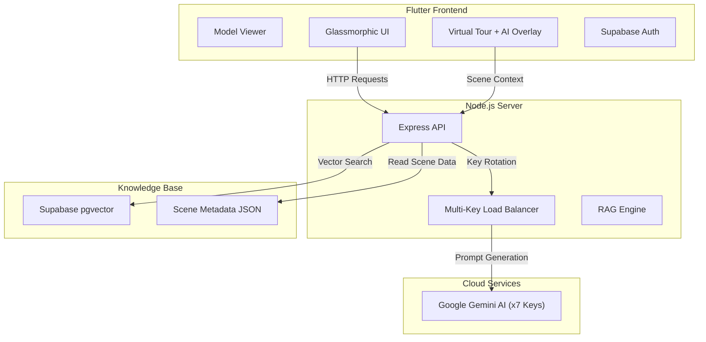

# Proactive Multimodal Academic Support System (Campus Assistant)

**Campus Assistant** is an advanced, AI-powered university companion app designed to revolutionize the student experience. It seamlesssly integrates a **Flutter Mobile App**, a **Node.js/Supabase Backend**, and **Google Gemini AI** to provide a unified platform for navigation, scheduling, and academic assistance.

---

## 🚀 Key Features

### 1. 🏛️ Immersive Landing Experience [NEW]
*   **Interactive 3D Campus Model**: A vertically centered, rotating 3D low-poly university building optimized for performance.
*   **Infinite Feature Carousel**: Smooth, auto-scrolling marquee showcasing app capabilities with semantic icons.
*   **Typewriter Animation**: Dynamic hero text with a custom "type-pause-delete" effect.
*   **Glassmorphic Overlay**: Premium UI design with separate top/bottom gradients for clarity.

### 2. 🤖 Virtual Tour AI Assistant [NEW]
*   **Context-Aware Chat**: An intelligent floating assistant inside the Virtual Tour that knows *exactly* where you are.
*   **Location Knowledge Base**: Ask *"What labs are in this building?"* or *"When does this library close?"* while viewing the actual scene.
*   **Scene-Specific prompts**: Auto-generates suggested questions based on the current panorama (e.g., "Show me the cafeteria menu" when near the food court).
*   **Fallback Robustness**: Works offline using cached scene data if the tour server is unreachable.

### 3. 🖥️ Advanced AI Backend (Multi-Key) [NEW]
*   **Load Balancing**: Distributed AI workload across **7 independent Gemini API Keys**.
*   **Auto-Failover**: Smart retry logic automatically switches keys if one hits a rate limit (429) or error.
*   **Role-Based Personas**:
    *   **Student**: Encouraging tone, focuses on actionable academic advice.
    *   **Faculty**: Professional tone, administrative focus.
    *   **Admin**: System-level operational updates.

### 4. 📱 Mobile-First Experience (Flutter)
*   **Cross-Platform**: Built with **Flutter** for Android & iOS.
*   **Glassmorphism UI**: Modern aesthetic with dark mode, blur effects, and smooth transitions.
*   **Offline First**: Critical data (Notes, Timetable) is cached for access without internet.

### 5. 🛡️ Role-Based Access Control (RBAC)
*   **Students**: Read-only access to their specific Class Schedule (`Dept-Year-Section`).
*   **Faculty**: Write access to their Department's Timetable and Notices.
*   **Admins**: Full system control ("God Mode") to manage all data.
*   **Secure Auth**: Powered by **Supabase Auth** & Google Sign-In with JWT sessions.

### 6. 📅 Smart Scheduling & Tasks
*   **Dynamic Timetable**: Real-time updates for the entire class when faculty changes a slot.
*   **Master PDF Export**: Admin/Faculty can generate and download full department schedules.
*   **Personal Reminders**: Private To-Do list with completion tracking.
*   **Event Board**: Centralized digital notice board for campus news and alerts.

---

## 🏗️ System Architecture


```mermaid
graph TD
    subgraph Mobile App [Flutter Frontend]
        3D[Model Viewer]
        Tour[Virtual Tour + AI Overlay]
        UI[Glassmorphic UI]
        Auth[Supabase Auth]
    end

    subgraph Backend [Node.js Server]
        API[Express API]
        LB[Multi-Key Load Balancer]
        RAG[RAG Engine]
    end

    subgraph Knowledge Base
        Vectors[Supabase pgvector]
        SceneData[Scene Metadata JSON]
    end

    subgraph Cloud Services
        Gemini["Google Gemini AI (x7 Keys)"]
    end

    %% Connections
    UI -->|HTTP Requests| API
    Tour -->|Scene Context| API
    
    API -->|Key Rotation| LB
    LB -->|Prompt Generation| Gemini
    
    API -->|Vector Search| Vectors
    API -->|Read Scene Data| SceneData
```

---

## 🛠️ Technology Stack

| Component | Tech |
| :--- | :--- |
| **Mobile App** | Flutter 3.x, Dart 3, Riverpod, GoRouter, webview_flutter, model_viewer_plus |
| **Backend** | Node.js, Express, TypeScript, dotenv |
| **Database** | Supabase (PostgreSQL), pgvector, Storage |
| **AI Model** | Google Gemini (Gemini-2.5-Flash / Pro) |
| **Hosting** | Render (Backend), Vercel/Netlify (Web components) |

---

## 📂 Project Structure

```bash
/
├── flutter_app/          # Mobile Application Code
│   ├── lib/
│   │   ├── screens/      # Landing, Dashboard, Tour, Timetable, etc.
│   │   ├── services/     # API Integration (TourService, AiService)
│   │   ├── widgets/      # Reusable UI (ScrollingIconRow, GlassContainer)
│   │   └── config/       # Themes, Routes, Constants
│   └── assets/           # 3D Models (.glb), Icons, Images
│
├── backend/              # Node.js Server Code
│   ├── src/
│   │   ├── controllers/  # Request Handlers
│   │   ├── routes/       # API Endpoints (virtual-tour, tasks, etc.)
│   │   ├── services/     # aiService (Multi-Key), dbService
│   │   └── data/         # scene_knowledge_base.json (Static Data)
│   └── package.json
│
└── MASTER_DEPLOYMENT_GUIDE.md  # Detailed Deployment Instructions
```

---

## ⚡ Getting Started

### 1. Prerequisites
*   Flutter SDK (3.x+)
*   Node.js (v18+)
*   Supabase Project

### 2. Setup Backend
1.  Navigate to `backend/`.
2.  Install dependencies: `npm install`.
3.  Create `.env` file with **7 Gemini API Keys** (`GEMINI_API_KEY_1`...`_7`) and Supabase credentials.
4.  Run server: `npm run dev`.

### 3. Setup Mobile App
1.  Navigate to `flutter_app/`.
2.  Install packages: `flutter pub get`.
3.  Ensure `assets/3D-model/` contains the `.glb` file.
4.  Run app: `flutter run`.

---

## 🔒 Security & Privacy
*   **Key Rotation**: API keys are rotated randomly to prevent exhaustion.
*   **RLS Policies**: Database access is strictly controlled by user role at the row level.
*   **Env Variables**: Critical secrets are never committed to version control.

